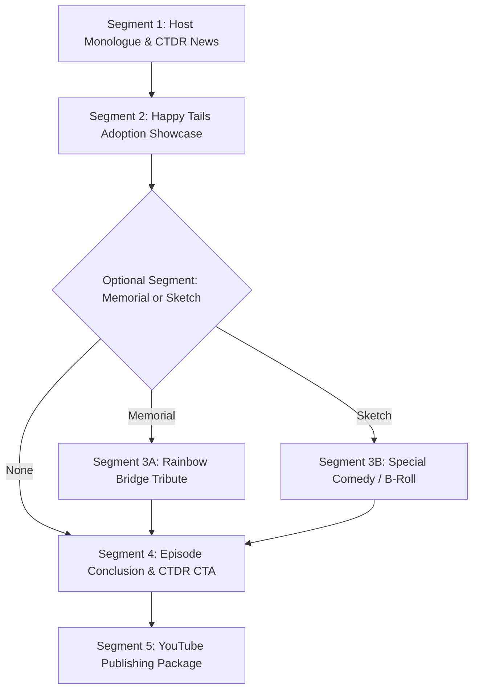

# Lone Star Doxie Talk (LSDT) — Creator Production Guide
*A comprehensive guide for creators producing monthly video podcast episodes for the Central Texas Dachshund Rescue (CTDR).*

---

## 🐾 1. Welcome & Show Mission

**Lone Star Doxie Talk** is an episodic, AI-assisted video podcast created to support the mission of the **Central Texas Dachshund Rescue (CTDR)**. Each month, the show brings together the rescue community to celebrate adopted dogs, remember beloved seniors, share fostering and event news, and encourage adoptions and donations across Texas and beyond.

The heart and soul of the show is its host: **Charlie**, an endearing, smooth reddish-tan dachshund who hosts from his cozy podcast desk equipped with his broadcast microphone, studio headphones, and CTDR coffee mug.

---

## 🎙️ 2. Host Persona & Mandatory Anchor Rules

Charlie's voice and personality are sacred to the show. Any content creator or AI agent writing for Charlie must adhere to these non-negotiable guidelines:

### The Voice:
* **Tone:** Warm, Southern, heartfelt, folksy, and compassionate.
* **Colloquialisms:** Classic Texan metaphors used naturally (e.g., *"I reckon"*, *"sit a spell"*, *"roundin' up the herd"*, *"pulling up the reins"*, *"helping paw"*, *"leader of the pack"*).
* **Focus:** Always centered on the dogs, the volunteer foster families, and CTDR supporters.

### Mandatory Anchor Lines:
1. **Show Opening Anchor:**
   > *"I'm Charlie and this here's Lone Star Doxie Talk."*  
   *(Must be the very first line spoken in the main episode monologue).*
2. **Show Closing Anchor:**
   > *"Until next time, remember, a rescued heart never forgets."*  
   *(Must be the final sentence spoken before the outro music/credits).*

### Critical TTS Cadence Rule:
* **Double-Newline Paragraph Breaks:** When writing any script destined for ElevenLabs TTS, **always separate every distinct thought, dog story, and topic with a double newline (`\n\n`)**.
* *Why:* Tightly-packed sentences cause TTS models to rush without pausing. Paragraph breaks give the voice natural human breath pauses and rhythm.

---

## 🎬 3. Anatomy of a Monthly Episode

A standard monthly episode runs approximately 3 to 6 minutes and is composed of these distinct segments:

### Segment Descriptions:
1. **Host Monologue & CTDR News:** Charlie welcomes listeners with his signature greeting, introduces the episode month/theme, and shares news (upcoming adoption events, foster needs, medical care sponsorships).
2. **Happy Tails Adoption Showcase:** Looking back at the prior month's adopted dogs. Each dog's photo is showcased on an animated card with their name, adoption date, and a heartfelt mini-story narrated by Charlie.
   * *Rule:* The Happy Tails script dives straight into the dog stories without repeating the podcast opening or sign-off.
3. **Rainbow Bridge Memorial (Optional):** A gentle, respectful tribute segment honoring rescue dogs who have crossed the Rainbow Bridge. Features softer acoustic music and dignified presentation.
4. **Specialty Comedy Sketch or B-Roll (Optional):** Seasonal or comedic cutaway scenes featuring Charlie (e.g., the October Halloween costume try-on montage).
5. **Episode Conclusion & Call to Action (CTA):** Charlie recaps all topics, directs viewers to `ctdr.org` to foster, adopt, or donate, and signs off with his trademark catchphrase.
6. **YouTube Video Package:** Formatted video description with chapter timestamps, CTDR donation links, URL placeholders (`[INSERT URL: ...]`), and hashtags.

---

## 🛠️ 4. Technical Specifications & Tool Stack

OpenMontage automates the assembly of Lone Star Doxie Talk using the **`lonestar-doxietalk`** pipeline and **`lonestar-doxietalk.yaml`** style playbook.

| Element | Tool / Engine | Specification / Key Identifier |
|---|---|---|
| **Pipeline Manifest** | OpenMontage Pipeline Engine | `pipeline_defs/lonestar-doxietalk.yaml` |
| **Style Playbook** | OpenMontage Style Engine | `styles/lonestar-doxietalk.yaml` |
| **Host Voice (TTS)** | ElevenLabs (`elevenlabs_tts`) | `CHARLIE_VOICE_ID=GdPqjbdsuwHYqzHrC45c` |
| **Host Visual Avatar** | Kling AI Avatar / Seedance 2.5 | Default Studio Portrait: `assets/lonestar-doxietalk/charlie_podcast_host_16x9.png` (or seasonal variant: `assets/lonestar-doxietalk/halloween_charlie_podcast_host_16x9.png`) |
| **Show Logo** | Brand Asset (Overlay / Outro) | `assets/lonestar-doxietalk/LoneStar_DoxieTalk_Logo.png` (1024x1024 transparent RGBA PNG) |
| **Rescue Logo (CTDR)** | Brand Asset (Lower-thirds / Outro) | `assets/lonestar-doxietalk/ctdr.png` (486x486 transparent RGBA PNG) |
| **Happy Tails Showcase** | Remotion Composition Engine | Animated dog cards, lower-thirds, smooth transitions |
| **BGM Music** | AudioMixer & Local Library | Warm acoustic country/folk guitar ducked at -18dB under dialogue |
| **Master Video Export** | FFmpeg / OpenMontage Stitcher | 1080p/720p 16:9 MP4 (`renders/final_episode.mp4`) |

---

## 📋 5. Creator Checklist: Preparing a New Episode

Before launching an episode run, gather the following materials:

- [ ] **Episode Identifier:** E.g., `lonestar-doxietalk-october-2026` or `september-happy-tails-adoptions`.
- [ ] **Main Topic & News:** Bullet points or a text file of announcements (adoption days, foster rallies, medical funds).
- [ ] **Adopted Dog Roster:**
  - Dog photos (named consistently, e.g., `dog_lexie.jpg`, `dog_cerberus.jpg`).
  - Dog names, adoption dates, and short personality snippets.
- [ ] **Seasonal Host Frame (Optional):** If producing a holiday or themed episode, verify the starting host portrait (e.g. `assets/lonestar-doxietalk/halloween_charlie_podcast_host_16x9.png`). Default is `assets/lonestar-doxietalk/charlie_podcast_host_16x9.png`.

---

## 🚀 6. Step-by-Step Production Workflow

Every episode progresses through 7 clear stages with **Human-in-the-Loop (HITL)** checkpoints:

### Stage 1: Idea & Episode Planning (`idea`)
* **What happens:** The agent ingests your topic notes and dog roster, creating `brief.json` and logging initial decisions.
* **Checkpoint:** You review the episode plan, segment lineup, and confirmed asset availability.

### Stage 2: Scriptwriting (`script`)
* **What happens:** The agent drafts Charlie's scripts:
  * Main monologue (starts with mandatory greeting)
  * Happy Tails bios (conversational, dog-centered)
  * Conclusion recap (ends with mandatory sign-off)
* **Checkpoint:** You review the script drafts directly on disk (`artifacts/script.md`). You can make manual tweaks or request a conversational revision before approving.

### Stage 3: Scene Staging & Audio Planning (`scene_plan`)
* **What happens:** The agent maps the timeline: host on-camera beats, Remotion adoption card timings, cutaway sketch insertion, and background music ducking curves.
* **Checkpoint:** Brief confirmation of timings and scene structure.

### Stage 4: Asset Generation (`assets`)
* **What happens:**
  * Charlie's narration audio is synthesized via ElevenLabs.
  * Host avatar video clips are generated.
  * Adoption dog photos are cropped and framed.
  * Acoustic guitar background music is prepped.
* **Checkpoint:** You listen to the voiceover clips and preview the host video before composition begins.

### Stage 5 & 6: Edit & Master Composition (`edit` & `compose`)
* **What happens:**
  * Remotion builds the Happy Tails animated motion-graphics reel.
  * OpenMontage stitches the host intro, adoption showcase, sketches, and conclusion into the final unified MP4 (`renders/final_episode.mp4`).
* **Checkpoint:** You watch the rendered episode deliverable.

### Stage 7: YouTube Packaging (`publish`)
* **What happens:** The agent reads all approved dialogue and outputs:
  * `artifacts/youtube_description.txt` with formatted timestamps, CTDR donation links, and hashtags.
  * A custom 16:9 thumbnail asset ready for YouTube upload.

---

## 💡 7. Pro Tips for Creators

1. **Pronunciations:** If Charlie mispronounces an unusual dog name or town name in ElevenLabs, use phonetic spelling in the script during Stage 2 review (e.g. *"Dox-ee"* instead of *"Doxie"*).
2. **Photo Framing:** For adoption photos submitted by foster families in vertical/portrait orientation, the Remotion template automatically centers the subject and applies an elegant blurred backdrop to preserve 16:9 framing without awkward black bars.
3. **Credit Preservation:** Audio and video assets are saved to disk immediately. If you need to make a small edit to a single segment, you can regenerate only that segment without re-billing previous approved clips.

---
*Lone Star Doxie Talk — Supporting Central Texas Dachshund Rescue (ctdr.org)*
